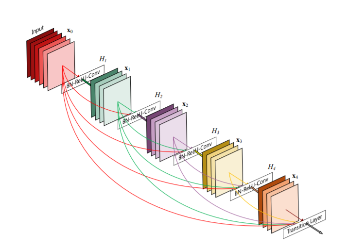
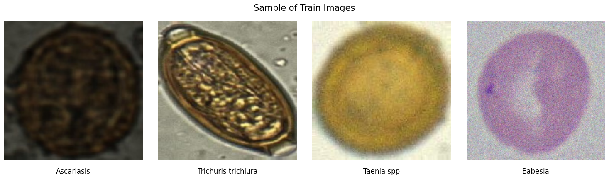
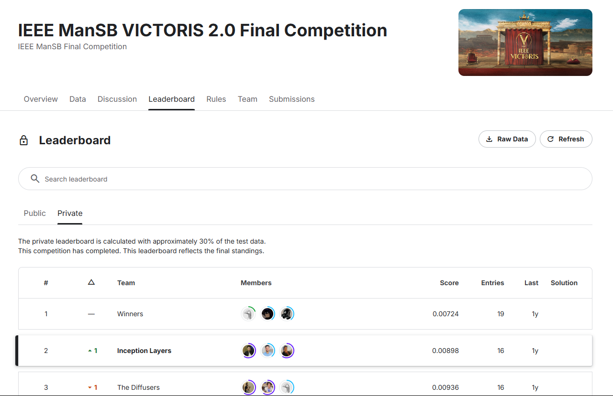

    

 

# Microscopic Medical Parasitology Classification

This repository presents a machine learning framework focused on microscopic parasitic image classification, leveraging deep learning for more accurate and accessible parasitology diagnostics. We employ a meticulously curated dataset covering 15 parasite classes, and use Keras along with transfer learning techniques to create a robust classification model.

## Outline
- [1. Project Context](#1-project-context)
- [2. Data Description](#2-data-description)
- [3. Image Data Preprocessing](#3-image-data-preprocessing)
- [4. Transfer Learning with ResNet101V2](#4-transfer-learning-with-resnet101v2)
- [5. Training Configuration and Callbacks](#5-training-configuration-and-callbacks)
- [6. Conclusion and Results](#6-conclusion-and-results)
- [7. Best Practices & Acknowledgments](#7-best-practices--acknowledgments)

## 1. Project Context

In the field of **Medical Parasitology**, early detection of parasitic infections is crucial for effective treatment and management. This project aims to:
- **Classify Microscopic Images**: Aiding medical professionals in diagnostics with an efficient, deep-learning-based tool.
- **Optimize Healthcare Resources**: Reduce diagnosis time, enabling better resource allocation.
- **Enhance Global Health Outcomes**: By improving access to rapid, accurate diagnostics.

**Significance**: This project supports proactive healthcare by facilitating early intervention and resource optimization, especially beneficial in regions with limited access to parasitology expertise.

## 2. Data Description

### Overview

The dataset used here includes high-quality, expertly annotated microscopic images from **15 distinct parasitic classes**, valuable for both medical diagnostics and data science research. Each class has been detailed below, covering its common health effects, diagnosis methods, and prevalence:

| Parasite                         | Description                             | Health Effects                                      | Diagnosis Method                                       | Geographic Prevalence              |
|----------------------------------|-----------------------------------------|----------------------------------------------------|--------------------------------------------------------|------------------------------------|
| **Ascariasis** (*Ascaris lumbricoides*) | A large roundworm that can grow up to 35 cm long | Can cause malnutrition, especially in children     | Stool sample for distinctive eggs                       | Asia, Africa, Latin America       |
| **Babesia**                      | Infects red blood cells                 | Causes flu-like symptoms, potentially severe       | Observing shapes in red blood cells                     | Northeastern US, Europe            |
| **Capillaria philippinensis**    | Small worm with barrel-shaped eggs      | Severe digestive issues, malnutrition               | Stool sample for unique egg shape                       | Southeast Asia                     |
| **Pinworm** (*Enterobius vermicularis*) | Common in children                   | Intense itching around the anus, especially at night | Scotch tape test for eggs                               | Worldwide, temperate areas        |
| **Epidermophyton floccosum**     | Skin and nail infection                 | Causes ringworm or athlete’s foot                  | Identification of club-shaped spores                    | Warm regions worldwide             |
| **Fasciolopsis buski**           | Intestinal flatworm                     | Causes digestive issues, malnutrition              | Large eggs in stool                                     | Asia                               |
| **Hookworm**                     | Infects through skin                    | Can cause anemia, growth issues in children        | Stool sample for eggs                                   | Tropical, subtropical regions     |
| **Rat Tapeworm** (*Hymenolepis diminuta*) | Infects rats primarily             | Mild symptoms in humans                           | Stool sample for large, round eggs                      | Worldwide                          |
| **Dwarf Tapeworm** (*Hymenolepis nana*) | Common in children                 | Reinfection, intensifying symptoms                 | Unique eggs with “polar filaments”                      | Warmer climates worldwide          |
| **Leishmania**                   | Intracellular parasite                  | Causes skin sores, or serious organ infections      | Observing parasite in white blood cells                 | Mediterranean, South America       |
| **Opisthorchis viverrini**       | Small liver fluke                       | Chronic liver issues, potential cancer             | Tiny, yellowish eggs in stool                           | Southeast Asia                     |
| **Paragonimus spp.**             | Lung fluke                              | Mimics tuberculosis, causing chest pain            | Brown eggs in sputum or stool                           | East Asia, Africa, Latin America  |
| **Trichophyton rubrum**          | Skin and nail infection                 | Long-lasting infections                          | Red color in lab cultures, spores identification       | Cities worldwide                   |
| **Taenia (Tapeworm)**            | From undercooked meat                   | Digestive issues; pork tapeworm serious            | Radially striped eggs in stool                          | Developing regions worldwide      |
| **Whipworm** (*Trichuris trichiura*) | Characteristic "barrel-shaped" eggs | Chronic digestive issues, growth delays in kids    | Stool sample for distinctive eggs                       | Tropical regions with poor sanitation |

Sample image data for training can be visualized below:

    

## 3. Image Data Preprocessing

Image preprocessing is critical for model performance. We used **Keras's ImageDataGenerator** with the following transformations:

- **Data Splits**:
  - **Training Set**: 10,723 images (90%)
  - **Validation Set**: 1,187 images (10%)

- **Preprocessing Steps**:
  1. **Rescaling**: Normalizes pixel values to the range [0, 1].
  2. **Data Augmentation**:
     - **Rotation**: Random rotation up to 20 degrees.
     - **Horizontal & Vertical Flips**: Introduces variation by flipping images.
     - **Fill Mode**: Uses nearest neighbor fill for empty pixels created by rotations.

- **Data Flow from Directory**:
  - Training images: Loaded from 'train-data' directory.
  - Validation images: Loaded from 'validation-data' directory.
  - Images are resized to 224x224 with a batch size of 32, using categorical class mode for one-hot encoded labels.

## 4. Transfer Learning with ResNet101V2

We employ **ResNet101V2** (pre-trained on ImageNet) with a modified classifier to enhance classification accuracy:

1. **Base Model Setup**:
   - **Input Shape**: (224, 224, 3)
   - **Exclude Top Layers**: Allows addition of custom classifier.

2. **Fine-tuning**:
   - The **base model layers** are trainable for gradual fine-tuning.

3. **Model Architecture**:
   - **Global Average Pooling**: Reduces spatial dimensions.
   - **Dropout Layers**: Prevents overfitting.
   - **Fully Connected Layer**: Dense layer with 1024 units.
   - **Softmax Output**: 15 output units for multi-class classification.

## 5. Training Configuration and Callbacks

Several configurations and callbacks enhance the training process:

1. **Learning Rate Schedule**: 
   - Starts at 4.5e-5, decreasing every 8 epochs.

2. **Callbacks**:
   - **LearningRateScheduler**: Adapts learning rate based on epoch count.
   - **ModelCheckpoint**: Saves the best-performing model.
   - **EarlyStopping**: Stops training after 12 epochs of no improvement.

3. **Class Weights**:
   - Adjusts for class imbalance, passing calculated weights into `model.fit`.

## 6. Conclusion and Results

Key highlights of the project:

- **Data Preprocessing**: Effective augmentation and scaling.
- **Model Architecture**: Robust feature extraction through ResNet101V2 with custom classification layers.
- **Training Configuration**: Dynamic learning rate and early stopping mechanisms to optimize performance.

**Competition Results**:
- **Score**: Public - 0.00847, Private - 0.00698
- **Position**: Secured **2nd place** 🏆

    

## 7. Best Practices & Acknowledgments

### Best Practices
1. **Efficient Data Loading**:
   - Batch processing with shuffling.
   - Use class weights for imbalanced data.

2. **Validation Strategy**:
   - Use stratified splits and cross-validation.

### Team

This project was brought to life by the following talented contributors:

- **[Ahmed El-Sharkawy](https://github.com/A7medElsharkawy)** – Developed the input data pipeline and played a key role in building, training, and validating the model.
- **[Youssef Yasser](https://github.com/youssef-yasser-ali)** – Contributed to the development of the input data pipeline and was involved in building, training, and validating the model.

I appreciate their dedication and hard work in making this project a success!

 
 

This keeps the information brief yet adds a touch of professional polish.

### Final Words of Gratitude

Thank you for exploring our project! We extend our heartfelt appreciation to all contributors, supporters, and users. Your feedback and contributions drive our improvement. For questions, feedback, or support, please reach out to the project maintainers.

---