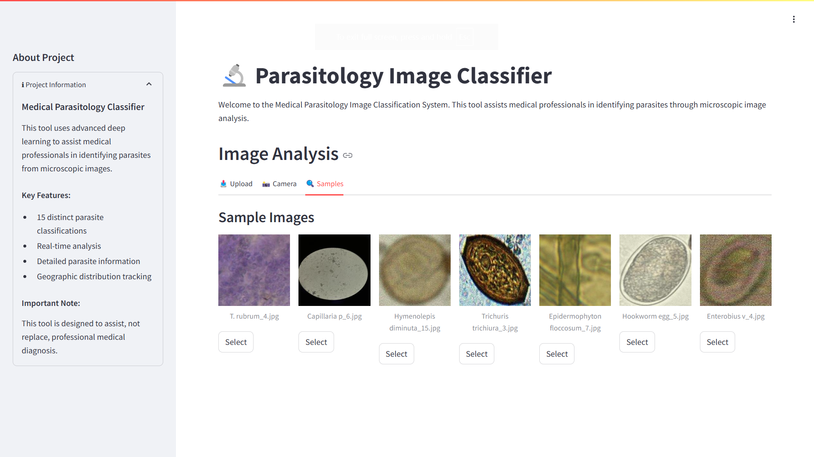
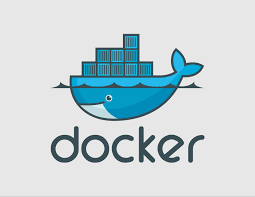
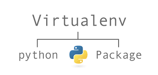

<p align="center">
    
</p>

[](README.md)
[](PROJECT-WORKFLOW.md)

# Microscopic Medical Parasitology Classification

An AI-powered application designed to assist medical professionals in diagnosing parasitic infections through microscopic images. This project leverages a deep learning model trained to classify 15 types of parasites, offering a valuable tool in medical parasitology, early diagnosis, and public health.

## Table of Contents

- [Overview](#overview)
- [Project Structure](#project-structure)
- [Setup and Usage](#setup-and-usage)
  - [Using Docker](#using-docker)
  - [Local Installation](#local-installation)
- [Technical Details](#technical-details)

## Overview

Microscopic analysis plays a crucial role in detecting parasitic infections, but it’s resource-intensive and requires specialized expertise. This project aims to support healthcare professionals by classifying microscopic images of parasites using a trained deep learning model. The model, developed through fine-tuning ResNet101V2, accurately identifies 15 types of parasites, making diagnostics more accessible and efficient.

## Project Structure

```bash
.
├── app.py                       # Main streamlit application file
└── utils.py                     # Helper functions for the application
└── microscopic.. .ipynb         # Development notebook
├── Dockerfile                   # Docker setup file
├── download_model.py            # Script to download model file
├── images/                      # Images for READMEs
├── data_samples/                # Sample images for testing
├── models/                      # Model directory
│   └── model.keras              # Trained Keras model
├── requirements.txt             # Python dependencies for the app
├── README.md                    # Project README for usage and installation
├── PROJECT-WORKFLOW.md          # Project-workflow README
```

## Setup and Usage

**🎉 Live Demo Available!**

Explore the live application at [parasiteclassifier.azurewebsites.net](https://parasiteclassifier.azurewebsites.net). This online version allows you to test the model directly in your browser. Due to limited hosting resources, response times may be slower, but the app works seamlessly using the methods below:

You can choose to run the application using **Docker** or by setting up a **local environment**. Follow the instructions for the method you prefer.

### Running with Docker

<p align="left">
    
</p>

Running the application with Docker is simple and ensures an isolated environment. Ensure Docker is installed and running on your machine.

#### 1. Pull the Docker Image

To pull the pre-built Docker image, run the following command:

```bash
docker pull sayedgamal/micro-parasite-classifier:v1.0
```

#### 2. Run the Docker Container

Launch the container using this command, which will expose the app on port 8501 of your localhost:

```bash
docker run -d -p 8501:8501 sayedgamal/micro-parasite-classifier:v1.0
```

#### 3. Access the Application

Open your web browser and go to [http://localhost:8501](http://localhost:8501) to access the Streamlit application.

<br>
<br>

### Running Locally

Follow these steps to set up and run the application locally. Ensure you have `pip` installed and Python is set up.

<p align="left">
    
</p>

#### 1. Clone the Repository

Clone the repository to your local machine:

```bash
git clone https://github.com/sayedgamal99/Microscopic-Medical-Parasitology-Classification.git
cd Microscopic-Medical-Parasitology-Classification
```

#### 2. Set Up a Virtual Environment

It is recommended to create and use a virtual environment to avoid package conflicts:

```bash
# Create a virtual environment
python -m venv micro_env

# Activate the virtual environment
# For Windows:
micro_env\Scripts\activate
# For Unix or MacOS:
source micro_env/bin/activate
```

#### 3. Install Dependencies

Install the required Python packages listed in `requirements.txt`:

```bash
pip install -r requirements.txt
```

#### 4. Download the Model

The model files are hosted on Kaggle. Follow these steps to download them:

##### a. Get Kaggle API Credentials

1. Go to your [Kaggle Account](https://www.kaggle.com).
2. Scroll down to the **API** section.
3. Click **Create New API Token** to download the `kaggle.json` file.
4. Place the downloaded `kaggle.json` file in the root directory of the project.

##### b. Run the Model Download Script

Once you have the `kaggle.json` file in place, run the following command to download the model files:

```bash
python download_model.py
```

This script will:

- Verify your Kaggle credentials.
- Install the Kaggle package if needed.
- Download and extract the model files into the `models` directory.

#### 5. Run the Application

Start the Streamlit application:

```bash
streamlit run app.py
```

#### 6. Access the Application

Open a web browser and go to:

- **URL**: [http://localhost:8501](http://localhost:8501)

The application should load and be ready for use.

<br>
<br>
<br>

## Technical Details

For a more in-depth understanding of the technical details, including the model architecture, data preprocessing, and training process, please refer to the [Project Workflow README](PROJECT-WORKFLOW.md).

---
