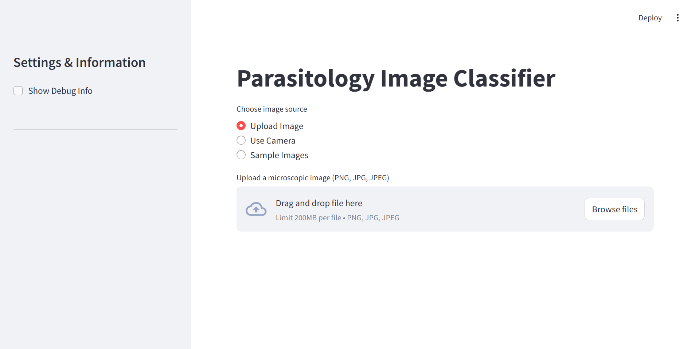

<p align="center">
    
</p>

[](https://github.com/sayedgamal99/Microscopic-Medical-Parasitology-Classification/blob/master/README-Workflow.md)

## Usage Instructions

This application can be run using **Docker** or by setting up a **local environment**. Follow the steps below for each method.

### Using Docker

<br>

<p align="left">
    
</p>

Running the application with Docker is straightforward and provides an isolated environment. Make sure Docker is installed and running on your machine.

1. **Pull the Docker Image**:

   Pull the pre-built Docker image from Docker Hub:

   ```bash
   docker pull sayedgamal/micro-parasite-classifier:v1.0
   ```

2. **Run the Docker Container**:

   Launch the container using the command below. This command will expose the app on port 8501 of your localhost:

   ```bash
   docker run -d -p 8501:8501 sayedgamal/micro-parasite-classifier:v1.0
   ```

3. **Access the Application**:

   Open a web browser and navigate to `http://localhost:8501` to access the Streamlit application.

---

<br>
<br>

## Using Local Installation

Follow these steps to set up and run the application locally. Ensure you have `pip` installed.

<p align="left">
    
</p>

### 1. Clone the Repository

```bash
git clone https://github.com/sayedgamal99/Microscopic-Medical-Parasitology-Classification.git
cd Microscopic-Medical-Parasitology-Classification
```

### 2. Set Up Virtual Environment

It's recommended to use a virtual environment to avoid package conflicts:

```bash
# Create virtual environment
python -m venv micro_env

# Activate virtual environment
# For Windows:
micro_env\Scripts\activate
# For Unix or MacOS:
source micro_env/bin/activate
```

### 3. Install Dependencies

Install the required packages:

```bash
pip install -r requirements.txt
```

### 4. Download the Model

The model files are hosted on Kaggle. Follow these steps to download them:

1. **Get Kaggle API Credentials**:

   - Go to [You Kaggle Acount](https://www.kaggle.com/account)
   - Scroll down to the "API" section
   - Click "Create New API Token" to download `kaggle.json`
   - Place the downloaded `kaggle.json` file in the project root directory

2. **Run the Download Script**:
   ```bash
   python download_model.py
   ```
   This script will:
   - Verify your Kaggle credentials
   - Install the Kaggle package if needed
   - Download and extract the model files to the `models` directory

### 5. Run the Application

Start the Streamlit application:

```bash
streamlit run app.py
```

### 6. Access the Application

Open your web browser and navigate to:

- URL: `http://localhost:8501`
- The application should load automatically and be ready for use

<br>
<br>

With either method, you’ll have full access to the parasite classification interface. Use the interface to upload images, classify, and explore results using the deep learning model.

---
